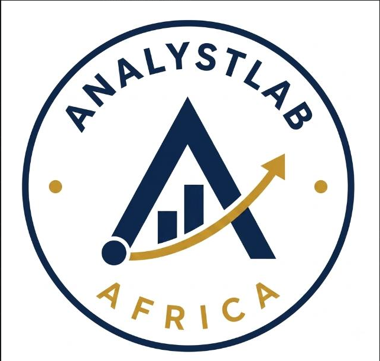
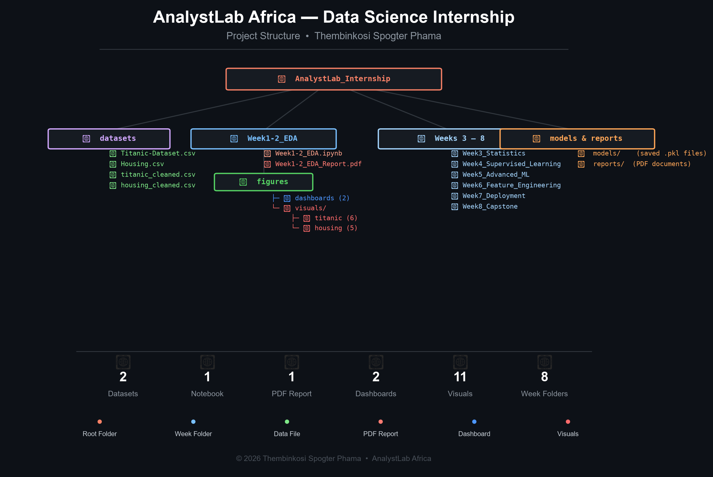

<!-- LOGO & TITLE SECTION -->
 

  
# AnalystLab Africa — Data Science Internship

**Intern:** Thembinkosi Spogter Phama  
**Program:** 8-Week Data Science Internship  
**Duration:** July 2026  
**Organization:** AnalystLab Africa  

 

 

---

## 📁 Project Structure

---

## 📋 Week-by-Week Progress

| Week | Topic | Status | Deliverables |
|------|-------|--------|--------------|
| **1–2** | Data Cleaning & EDA | ✅ Complete | Notebook, PDF Report, 11 Visuals, 2 Dashboards |
| 3 | Statistics & Probability | 🔜 Upcoming | Statistical Analysis Report |
| 4 | Supervised Learning | 🔜 Upcoming | ML Models Notebook |
| 5 | Advanced ML | 🔜 Upcoming | Model Comparison Report |
| 6 | Feature Engineering | 🔜 Upcoming | Optimized Models |
| 7 | Model Deployment | 🔜 Upcoming | Flask/Streamlit App |
| 8 | Capstone Project | 🔜 Upcoming | End-to-End Project |

---

## ✅ Week 1–2: Data Cleaning & Exploratory Data Analysis

### 📊 Datasets Used

| Dataset | Rows | Columns | Source |
|---------|------|---------|--------|
| Titanic | 891 | 12 | Kaggle |
| Housing Prices | 545 | 13 | Kaggle |

### 🔧 Tasks Completed

- Loaded and explored both datasets
- Handled missing values (Age: median, Embarked: mode, Cabin: dropped)
- Removed duplicates
- Performed univariate & bivariate analysis
- Created **11 individual visualizations**
- Built **2 comprehensive dashboards**
- Generated correlation heatmaps
- Identified key predictors for modeling

### 💡 Key Insights

<b>🚢 Titanic Dataset Insights (Click to expand)</b>

 

- **Overall Survival Rate:** 38.4% (342 out of 891 passengers)
- **Gender Impact:** Women survived at a significantly higher rate (74.2%) than men (18.9%)
- **Class Impact:** 1st class (62.9%), 2nd class (47.3%), 3rd class (24.2%)
- **Age Pattern:** Most passengers aged 20–40; children had higher survival rates
- **Top Predictors:** Pclass (-0.34), Fare (+0.26)

<b>🏠 Housing Dataset Insights (Click to expand)</b>

 

- **Price Range:** 1.3M to 13.3M
- **Strongest Price Predictor:** Area (+0.54 correlation)
- **Furnishing Impact:** Furnished houses command premium prices
- **Top Predictors:** Area (0.54) → Bathrooms (0.52) → Stories (0.42) → Parking (0.38) → Bedrooms (0.37)

---

## 🛠️ Technologies Used

| Category | Tools |
|----------|-------|
| **Language** | Python 3.14 |
| **Data Manipulation** | Pandas, NumPy |
| **Visualization** | Matplotlib, Seaborn |
| **Notebook** | Jupyter Notebook |
| **Reports** | fpdf2 |
| **Version Control** | Git & GitHub |

---

## 📂 Week 1–2 Deliverables

- **Jupyter Notebook:** `Week1-2_EDA/Week1-2_EDA.ipynb`
- **PDF Report:** `Week1-2_EDA/Week1-2_EDA_Report.pdf`
- **Dashboards (2):** `Week1-2_EDA/figures/dashboards/`
  - Titanic Dashboard
  - Housing Dashboard
- **Visuals (11):** `Week1-2_EDA/figures/visuals/`
  - Titanic (6 visualizations)
  - Housing (5 visualizations)
- **Cleaned Datasets:** `datasets/`
  - titanic_cleaned.csv
  - housing_cleaned.csv

---

## 🔗 Connect

 

### Made with dedication during the AnalystLab Africa Internship Program

**#AnalystLabAfrica #DataScience #EDA #Python #MachineLearning #DataAnalytics**

